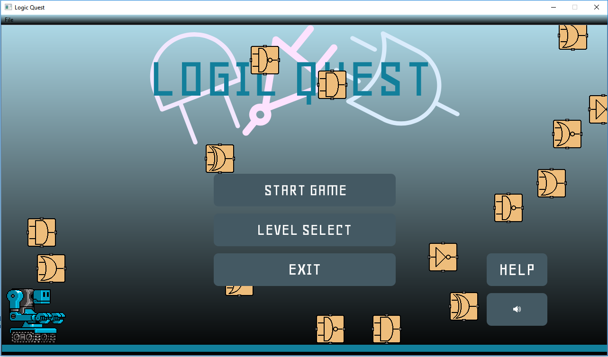
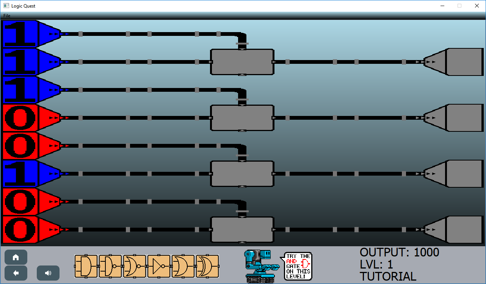
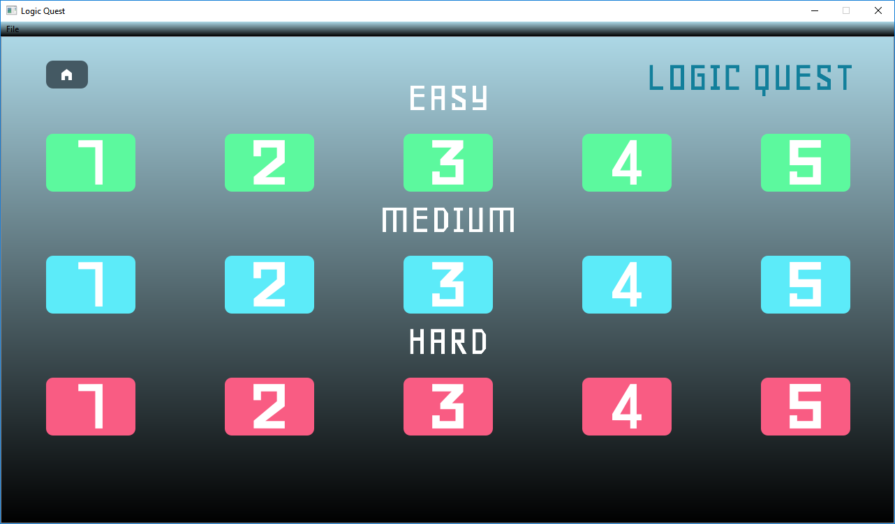
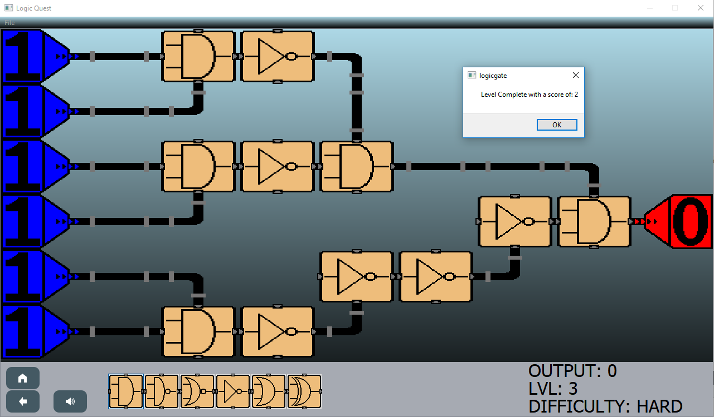
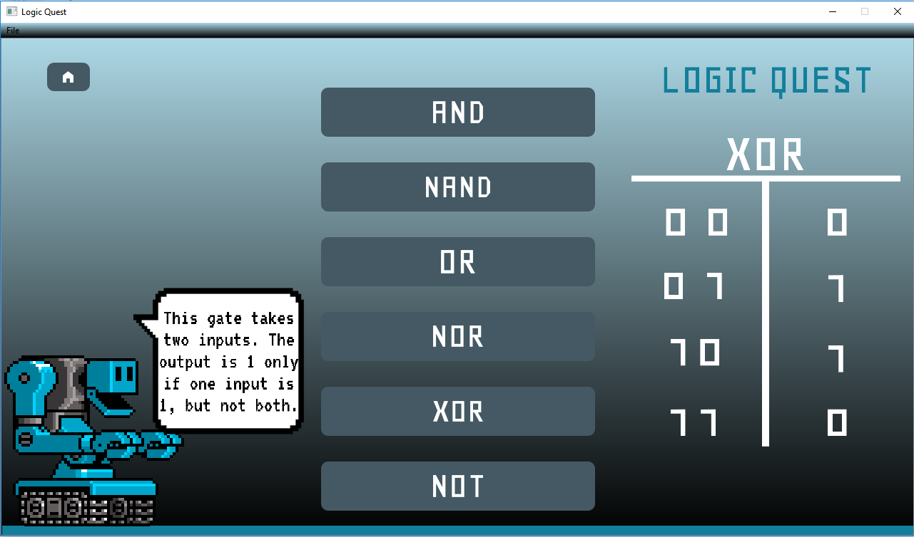

# Logic-Quest
An educational app designed to teach the user about logic gates (AND, OR, etc.) through drag and drop puzzles.

## Compilation Notes
1. Compilation will not work on 32 bit Windows without modifying logicgate.pro, only 64.
2. MacOS is untested.
3. Non Mac unix systems should compile, though very minimal testing was done here.

## Screenshots

